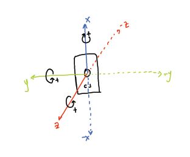

# Signal processing 

From the <i>.csv</i> files obtained after unencrypting the <i>.shrd</i> files, multiple processing steps take place. In general, the algorithm follows this structure:

The following sections include an in-depth description of these steps.
 
## Segmenting of data based on temperature
The initial steps of the processing algorithm are focused on identifying when the sensors are disconnected from the subject. This is done based on temperature readings from both the Anne&#174 Chest sensor and the Anne&#174 Limb sensor, as follows:

After identifying the termination times, the signals can be preprocessed and segmented within the times of interest, i.e., when the participant have been wearing both Anne&#174 sensors simultaneously.

## Pre-processing of signals
### ECG signals
The preprocessing for ECG signals consists in segmenting the data, flipping the signal if necessary, resampling to a fixed sampling rate using interpolation, and removing timing synchonization spikes introduced by the Anne&#174 firmware. This synchronization spikes occur every second and are intended to synchronize the internal clocks from both Anne&#174 devices. 

### PPG signals
In a similar way, PPG signals are initially segmented according to the start and termination times, then the red and infrared PPG signals are substracted to obtain a single PPG signal, which is the filtered to remove the baseline. Finally, this signal is also resampled using interpolation and the timing synchronization spikes are removed:

### IMU data
The accelerometer data obtain from the triaxial accelerometer Anne&#174 Chest sensor is resampled to a fixed sampling rate and filtered before any additional processing is performed:  

As a reference, this is the coordinate system used by the Anne&#174 Chest sensor:

### Temperature data 
The temperature information, obtained independently from both Anne&#174 sensors, is resampled to the most frequent sampling rate, according to the median value of the difference between consecutive timing points for the temperature data acquired.  

## Cardiovascular signal analysis

### Heart rate estimation from ECG 
#### QRS detection
The initial step for ECG processing is identifying the location of QRS complexes, and extracting some features from them. These features will later be used for signal quality estimation and filtering of the ECG cardiac cycles. The following diagram depicts the QRS detection algorithm:

#### Quality assessment for R-to-R intervals
After QRS complexes are detected, their quality is assessed based on a clustering algorithm: 

#### Heart rate estimation
Instantaneous heart rates are then estimated using the R-to-R intervals, and these are corrected as explained in the following diagram: 

### Pulse rate estimation from PPG
### Fiducial point detection
The cardiac cycle detection from PPG signals is done by identifying fiducial points from each cardiac pulse wave. Also, an initial estimation of signal quality for these cardiac cycles is initially performed, as shown in the following diagram:

#### Quality assessment for interbeat intervals
As was done with the ECG-derived cardiac intervals, the quality of interbeat intervals obtained from the fiducial point detection from PPG signals was assessed. Similarly, a clustering algorithm based on HDBSCAN was applied to identify the cardiac cycles with acceptable quality:

#### Pulse rate estimation
Instantaneous pulse rates are then estimated using the interbeat intervals considered of good quality. As done with heart rate estimates, these values are also corrected and their outliers are removed. In this case, pulse rates are estimated from the time differences between consecutive maximum slope points and between consecutive peaks, following the same process as for the heart rate estimates from the ECG. 

#### Oxygen saturation
The Anne&#174 system returns an oxygen saturation (SpO2) measure every second. However, this is not synchronized with the rest of the data obtained from the Anne&#174 devices. Hence, the information regarding oxygen saturation is used to correct this synchronization:

### Pulse arrival time (PAT) analysis
In the cases when both ECG and PPG analysis is successful it is possible to extract matched metrics from features obtained from these two signals. Here, Pulse Arrival Time (PAT) and matched heart rate measures are extracted:

## Features from IMU data
Several features are extracted from the accelerometers, especially for identifying the body position of the subject:

## Derivation of respiratory information
From the ECG, the PPG, the PAT and the accelerometers, it is possible to derive respiratory information. The initial approach to derive respiratory information from any of these sources is as follows: 

From the ECG, two independent respiratory estimations are obtained, from the amplitudes of the R peaks and the estimated heart rates. 

From the PPG, respiratory information are obtained using the amplitudes of cardiac cycles measured as the difference between onsets and peaks, the amplitudes measured as the difference between maximum slope points and peaks, and the estimated pulse rates. In addition, respiratory information is obtained from PAT measures estimated using the maximum slope points and the R peaks.

Finally, respiratory information is obtained from the X, Y and Z channels from the accelerometer, as well as from the L2 norm between X and Z (XZ).

## Outputs

The general processing algorithm outputs one <i>.edf</i> file with the following data:

| Signal         | Header name      | Description [units]                                                                                                                         | 
| :------------- | :--------------- | :------------------------------------------------------------------------------------------------------------------------------------------ |
| ECG            | ecgRaw           | Raw ECG signal, sampled at 100 Hz                                                                                                           |
|                | ecgProcessed     | ECG signal resulting after Wavelet filtering, sampled at 100 Hz                                                                             |
|                | zeroCrossingRate | Rate of QRS complexes that cross zero, sampled at 100 Hz                                                                                    |
|                | ecgSQI           | Signal quality indices for QRS complexes based on Hilbert transform, sampled at 10 Hz                                                       |
|                | ECG.SQI          | Signal quality indices for ECG based on comparison between consecutive beats, , sampled at 10 Hz                                            |
|                | ECGamp           | Amplitude of QRS complexes, sampled at 10 Hz                                                                                                |   
|                | HR.ECG           | Instantaneous heart rate measured from ECG, sampled at 10 Hz [beats per minute]                                                             |
|                | ECGamp.filt      | Respiratory signal estimate extracted from the changes in QRS amplitudes, sampled at 10 Hz                                                  |
|                | RR.ECGamp        | Instantaneous respiratory rate measured from the changes in QRS amplitudes, sampled at 1 Hz [breaths per minute]                            |
|                | RRamp.ECGamp     | Amplitude of respiratory cycles extracted from the changes in QRS amplitudes, sampled at 1 Hz                                               |
|                | RRsqi.ECGamp     | Signal quality metric for respiratory estimates extracted from the changes in QRS amplitudes, sampled at 1 Hz                               |
|                | HRecg.filt       | Respiratory signal estimate extracted from the changes in QRS amplitudes, sampled at 10 Hz                                                  |
|                | RR.HRecg         | Instantaneous respiratory rate measured from the changes in heart rate, sampled at 1 Hz [breaths per minute]                                |
|                | RRamp.HRecg      | Amplitude of respiratory cycles extracted from the changes in heart rate, sampled at 1 Hz                                                   |
|                | RRsqi.HRecg      | Signal quality metric for respiratory estimates extracted from the changes in heart rate, sampled at 1 Hz                                   |
|                | ecgRRraw         | Instantaneous duration of R-to-R intervals, sampled at 100 Hz [seconds]                                                                     |
|                | ecgRRint         | Instantaneous duration of R-to-R intervals after signal quality filtering, sampled at 100 Hz [seconds]                                      |
| PPG            | ppgRaw           | Raw PPG signal, sampled at 100 Hz                                                                                                           |
|                | ppgFiltered      | Filtered PPG signal, sampled at 100 Hz                                                                                                      |
|                | ppgSQI           | Signal quality indices for PPG beats based on Gaussian functions, sampled at 10 Hz                                                          |
|                | PPG.SQI          | Signal quality indices for PPG based on comparison between consecutive beats, sampled at 10 Hz                                              |
|                | PPGamp           | Amplitude of PPG cardiac cycles from the onset to the peak, sampled at 10 Hz                                                                |
|                | PPGfootpeak      | Amplitude of PPG cardiac cycles from the maximum slope point to the peak, sampled at 10 Hz                                                  |
|                | HR.PPG           | Instantaneous heart rate measured from PPG, sampled at 10 Hz [beats per minute]                                                             |
|                | PAT              | Instantaneous pulse arrival time, sampled at 10 Hz [seconds]                                                                                |
|                | PAT.SQI          | Signal quality indices for PAT based on comparison between consecutive beats, sampled at 10 Hz                                              |
|                | HR.combi         | Instantaneous heart rate measured from ECG and PPG, sampled at 10 Hz [beats per minute]                                                     |
|                | SpO2             | Oxygen saturation, sampled at 10 Hz [%]                                                                                                     |
|                | PPGfootpeak.filt | Respiratory signal estimate extracted from the changes in maximum slope point to peak amplitudes, sampled at 10 Hz                          |
|                | PPGamp.filt      | Respiratory signal estimate extracted from the changes in onset to peak amplitudes, sampled at 10 Hz                                        |
|                | RR.PPGamp        | Instantaneous respiratory rate measured from the changes in onset to peak amplitudes, sampled at 1 Hz [breaths per minute]                  |
|                | RRamp.PPGamp     | Amplitude of respiratory cycles extracted from the changes in onset to peak amplitudes, sampled at 1 Hz                                     |
|                | RRsqi.PPGamp     | Signal quality metric for respiratory estimates extracted from the changes in onset to peak amplitudes, sampled at 1 Hz                     |
|                | HRppg.filt       | Respiratory signal estimate extracted from the changes in pulse rate, sampled at 10 Hz                                                      |
|                | RR.HRppg         | Instantaneous respiratory rate measured from the changes in pulse rate, sampled at 1 Hz [breaths per minute]                                |
|                | RRamp.HRppg      | Amplitude of respiratory cycles extracted from the changes in pulse rate, sampled at 1 Hz                                                   |
|                | RRsqi.HRppg      | Signal quality metric for respiratory estimates extracted from the changes in pulse rate, sampled at 1 Hz                                   |
|                | PAT.filt         | Respiratory signal estimate extracted from the pulse arrival time, sampled at 10 Hz                                                         |
|                | RR.PAT           | Instantaneous respiratory rate measured from the pulse arrival time, sampled at 1 Hz [breaths per minute]                                   |
|                | RRamp.PAT        | Amplitude of respiratory cycles extracted from the pulse arrival time, sampled at 1 Hz                                                      |
|                | RRsqi.PAT        | Signal quality metric for respiratory estimates extracted from the pulse arrival time, sampled at 1 Hz                                      |
|                | ppgMMraw         | Instantaneous duration of cardiac cycles based on maximum slope point locations, sampled at 100 Hz [seconds]                                |
|                | ppgMMint         | Instantaneous duration of cardiac cycles based on maximum slope point locations after signal quality filtering, sampled at 100 Hz [seconds] |
|                | ppgNNraw         | Instantaneous duration of cardiac cycles based on peak locations, sampled at 100 Hz [seconds]                                               |
|                | ppgNNint         | Instantaneous duration of cardiac cycles based on peak locations after signal quality filtering, sampled at 100 Hz [seconds]                |
| Accelerometers | x                | X-channel from accelerometer after moing average filtering, sampled at 100 Hz [G]                                                           |
|                | y                | Y-channel from accelerometer after moing average filtering, sampled at 100 Hz [G]                                                           |
|                | z                | Z-channel from accelerometer after moing average filtering, sampled at 100 Hz [G]                                                           |
|                | position         | Position of the body at any instant, sampled at 10 Hz [0: upright; -1: side; -2: back; -3: front]                                           |
|                | theta            | Angle of recline measured as arctan(-x/(sqrt(y^2 + z^2))), sampled at 10 Hz [degrees]                                                       |
|                | phi              | Angle of inclination measured as arctan(y/z), sampled at 10 Hz [degrees]                                                                    |
|                | ENMO             | Euclidean norm minus one measured as |sqrt(x^2 + y^2 + z^2) - 1|, sampled at 100 Hz                                                         |
|                | x.filt           | Respiratory signal estimate extracted from the X-channel, sampled at 10 Hz                                                                  |
|                | RR.x             | Instantaneous respiratory rate measured from the X-channel, sampled at 1 Hz [breaths per minute]                                            |
|                | RRamp.x          | Amplitude of respiratory cycles extracted from the X-channel, sampled at 1 Hz                                                               |
|                | RRsqi.x          | Signal quality metric for respiratory estimates extracted from the X-channel, sampled at 1 Hz                                               |
|                | y.filt           | Respiratory signal estimate extracted from the Y-channel, sampled at 10 Hz                                                                  |
|                | RR.y             | Instantaneous respiratory rate measured from the Y-channel, sampled at 1 Hz [breaths per minute]                                            |
|                | RRamp.y          | Amplitude of respiratory cycles extracted from the Y-channel, sampled at 1 Hz                                                               |
|                | RRsqi.y          | Signal quality metric for respiratory estimates extracted from the X-channel, sampled at 1 Hz                                               |
|                | z.filt           | Respiratory signal estimate extracted from the Z-channel, sampled at 10 Hz                                                                  |
|                | RR.z             | Instantaneous respiratory rate measured from the Z-channel, sampled at 1 Hz [breaths per minute]                                            |
|                | RRamp.z          | Amplitude of respiratory cycles extracted from the Z-channel, sampled at 1 Hz                                                               |
|                | RRsqi.z          | Signal quality metric for respiratory estimates extracted from the X-channel, sampled at 1 Hz                                               |
|                | RR.xz            | Instantaneous respiratory rate measured from the L2 norm of X- and Z-channels, sampled at 1 Hz [breaths per minute]                         |
|                | RRamp.xz         | Amplitude of respiratory cycles extracted from the L2 norm of X- and Z-channels, sampled at 1 Hz                                            |
|                | RRsqi.xz         | Signal quality metric for respiratory estimates extracted from the L2 norm of X- and Z-channels, sampled at 1 Hz                            |
| Temperature    | chestTemp        | Chest temperature, sampled at 1 Hz [degrees Celsius]                                                                                        |
|                | limbTemp         | Limb temperature, sampled at 1 Hz [degrees Celsius]                                                                                         |

This file is named as <i>{File prefix}-features.edf</i>, where <i>{File prefix}</i> has the followinfg structure: <i>{ProjectID} _ {Follow-up year} _ {Placement date}_{Start time}</i>.

In addition to the <i>.edf</i> file, the following <i>.csv</i> files are obtained after the algorithm is run:

- Spikes file (<i>{File prefix}-spikes.csv</i>): Single column <i>.csv</i> file with the times at which synchronization spikes were detected in the PPG signal.  

- ECG peaks file (<i>{File prefix}-peaksECG.csv</i>): Features extracted from the ECG signal. These are: 

| Column           | Description [units]                                                                                                                         | 
| :--------------- | :------------------------------------------------------------------------------------------------------------------------------------------ |
| ECGsqi           | Signal quality indices based on the Hilbert transform for each QRS complex identified from the ECG signal                                   |
| Rpeaks           | Timings for the identified R peaks [seconds]                                                                                                |
| ECGamp           | Amplitude of identified R peaks, measured as the difference between the peaks and the valleys                                               |
| peakamp          | Absolute amplitude of the peaks, measured as the absolute difference of each peak minus the baseline of the ECG                             |
| valleyamp        | Absolute amplitude of the valleys, measured as the absolute difference of each valley minus the baseline of the ECG                         |
| envelopeamp      | Amplitude of peaks identified in the envelope of the filtered ECG signal                                                                    |
| spikiness        | Amplitude of the maximum value of the envelope in a window centered in the detected R peak with a size of 10% of the sampling rate          |   

- PPG peaks file (<i>{File prefix}-peaksPPG.csv</i>): Features extracted from the PPG signal. These are: 

| Column           | Description [units]                                                                                                                         | 
| :--------------- | :------------------------------------------------------------------------------------------------------------------------------------------ |
| PPGsqi           | Signal quality indices based on the correlation with Gaussian functions for each cardiac cycle identified from the PPG signal               |
| Peaks            | Timings for the identified peaks at each cardiac cycle [seconds]                                                                            |
| Feet             | Timings for the identified valleys at each cardiac cycle [seconds]                                                                          |
| Mids             | Timings for the identified maximum slope point at each cardiac cycle [seconds]                                                              |

- Beatdata file (<i>{File prefix}-beatdata.csv</i>): Features extracted from the ECG and PPG signals, and from the combined analysis for PAT estimation. It includes both the ECG and PPG features from matched cycles and these additional features:

| Column           | Description [units]                                                                                                                         | 
| :--------------- | :------------------------------------------------------------------------------------------------------------------------------------------ |
| zcr              | Rate of zero crossing for each QRS complex                                                                                                  |
| s                | Rolling standard deviation of the instantaneous heart rate [beats per minute]                                                               |
| z                | Rolling standard deviation of the zero crossing rate                                                                                        |
| beat             | Number of the beat from the ECG                                                                                                             |
| peak_to_valley   | Absolute ratio between the amplitude of the peak and the amplitude of the valley for each QRS complex                                       |
| QC               | Signal quality metric for each QRS complex based on clustering [True, False]                                                                |
| ecgRRraw         | Instantaneous duration of R-to-R intervals [seconds]                                                                                        |
| ecgRRint         | Instantaneous duration of R-to-R intervals after signal quality filtering [seconds]                                                         |
| HR.ECG           | Instantaneous heart rate measured from the ECG after signal quality filtering and outlier removal [beats per minute]                        |
| ECGamp           | Amplitude of QRS complexes after outlier removal                                                                                            |
| zcr.1            | Rate of zero crossing for each cardiac cycle identified in the PPG signal                                                                   |
| PPGamp           | Amplitude of the cardiac cycles measured as the difference between the amplitude of the peak and the onset                                  |
| PPGfootpeak      | Amplitude of the cardiac cycles measured as the difference between the amplitude of the peak and the maximum slope point                    |
| ends             | Timings for the ending point of each cardiac cycle, as the timings of the maximum slope points [seconds]                                    |
| duration         | Duration of each cardiac cycle, measured as the time difference between consecutive maximum slope points [seconds]                          |
| PPGpeakfoot      | Duration of the cycle between the peak and the subsequent maximum slope point [seconds]                                                     |
| beats            | Number of the beat from the PPG                                                                                                             |
| SS               | Signal quality metric for each PPG cardiac cycle based on its similarity to a template defined by clustering                                |
| include          | Boolean indicating if the cardiac cycle is to be included in subsequent analyses [True, False]                                              |
| ppgMMraw	       | Instantaneous duration of interbeat intervals based on peaks [seconds]                                                                      |
| ppgMMint         | Instantaneous duration of interbeat intervals based on peaks after signal quality filtering [seconds]                                       |
| ppgNNraw         | Instantaneous duration of interbeat intervals based on maximum slope points [seconds]                                                       |
| ppgNNint         | Instantaneous duration of interbeat intervals based on maximum slope points after signal quality filtering [seconds]                        | 
| HR.PPG           | Instantaneous pulse rate measured from the PPG after signal quality filtering and outlier removal [beats per minute]                        |
| R.clean          | Timings for R peaks considered for PAT estimation based on the synchrony between ECG R peaks and PPG maximum slope points [seconds]         |
| PATfeet          | Pulse arrival time measured between the R peaks and the onset of the PPG cardiac cycles [seconds]                                           |
| PAT              | Pulse arrival time measured between the R peaks and the maximum slope point of the PPG cardiac cycles [seconds]                             |
| HR.combi         | Instantaneous heart rate measured from both ECG and PPG, after signal quality filtering and outlier removal [beats per minute]              |

- Quality control file (<i>{File prefix}-QC.csv</i>): Mean value of the signal quality indices for each of the signals, based on the behaviour between consecutive points. The <i>.csv</i> files contains a single column with:

    1. The identification code for the file.
    2. The mean value of the signal quality metric for the PPG, ECG and PAT data, respectively.
    3. The mean value of the signal quality array for the PPG, ECG and PAT data, respectively. This value indicates if the average duration of longer runs of good quality signal portions for each of the signals was greater than 200 seconds.
    4. Gross lag between ECG and PPG, considered for PAT estimation.

