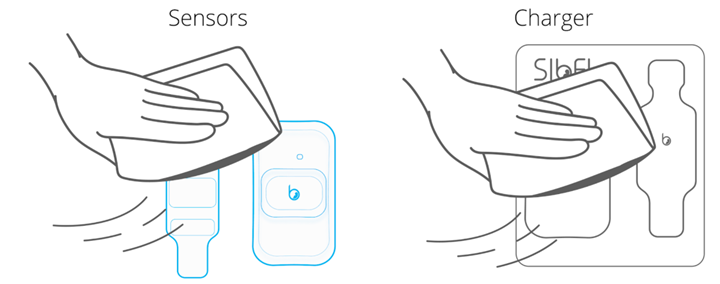
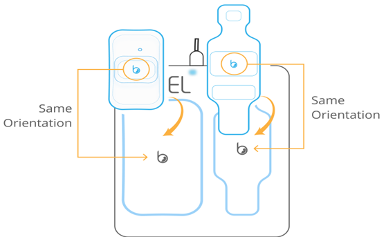
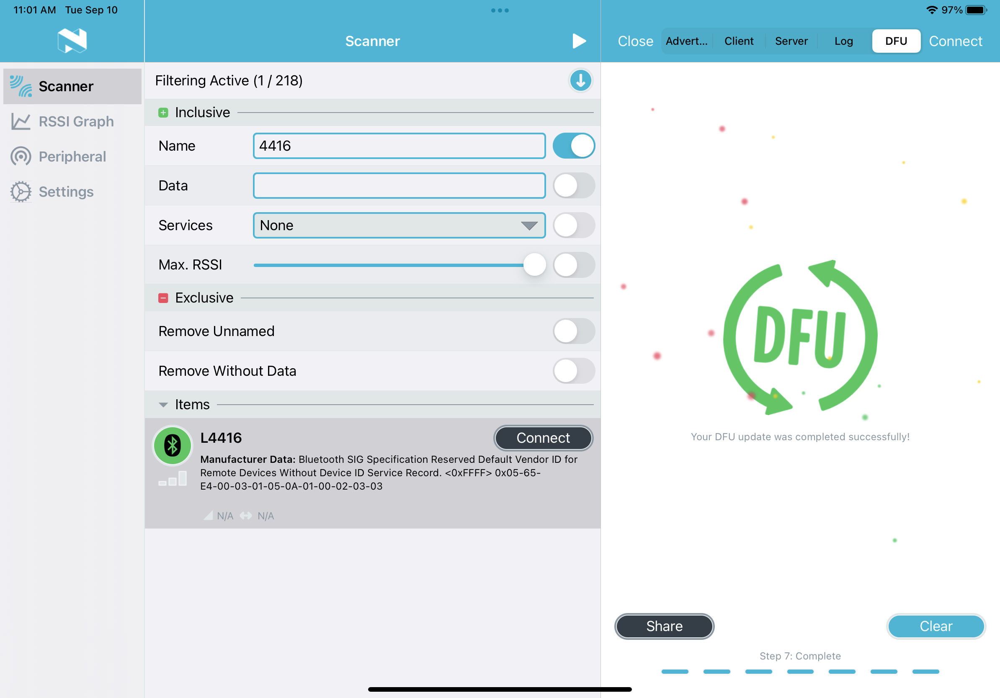

# How is data collected?

## <b>Sensor setup</b> 
Both the chest and limb sensors need to be prepared before being deployed to the field, where the data is collected. To do this, follow these instructions:

- Clean both sides of the Chest and Limb sensors and the charger with a cleaning wipe: 



- Connect the charger to a power supply, either using the wall adapter or a USB-C cable. Once connected and powered, the charger should have a blue light indicating that it is powered:


- Place the sensors on the charger following the outlines on the charging surface. Make sure the logos of the sensors are aligned with the logos on the charging pad:



- A green LED light on each of the sensors will blink every five seconds indicating the sensors are charging. Average duration for a full charge is 5 hours. When fully charged the green LED light will remain solid. Battery charge level can be monitored using the [DiscoveryRA](https://sibelhealth.com/clinical-trials-and-research/) mobile application. 


- Whilst the sensors are being charged, verify the firmware in both devices. <b><font color = #728FCE> Update the firmware for each device if the version installed does not correspond to the last version available</font></b>. To do this:

    - Save the last version of the firmware onto the device that's being used for configuring the Anne&#174 sensors. This should be an iOS compatible device with the [nRF Connect](https://www.nordicsemi.com/Products/Development-tools/nRF-Connect-for-mobile) app installed.

    - Open the [nRF Connect](https://www.nordicsemi.com/Products/Development-tools/nRF-Connect-for-mobile) app and scan for devices. Connect to the desired Anne&#174 sensor

    

    - Click on "Client" on the top of the screen and scroll down to "Firmware Revision String." Click the downwards arrow. Verify the current firmware on the device.

    

    - If the firmware needs to be updated, click on "DFU":

    

    - Press "Open Document Picker" on the bottom of the screen and select the correct firmware for the Anne&#174 sensor from your local files.
    <br></br>
    !!! note
        Make sure the firmware selected matches the Anne&#174 sensor. Limb sensors serial numbers start with L, whilst serial number for Chest sensors start with a C. Selecting the wrong firmware file may lead to complete damage of the sensor.

    
    
    - Press "Start" and wait until the upload process finishes. The status will say "Your DFU update was completed successfully!" when the firmware is succesfully downloaded.

    

    - Connect back to the device and verify that the current firmware version on the device corresponds to the newly installed firmware by selecting "Firmware Revision String." If the update was succesful, hit "Close" and disconnect from the Anne&#174 device. Otherwise, repeat the process. 

    <br></br>
    !!! note
        The current firmware version for Chest sensors is <b>[3.3.5+mT_RevJ](https://rush-my.sharepoint.com/:u:/r/personal/robert_dawe_rush_edu/Documents/RADC_Device_Group/ANNE/Firmware/Chest_v3.3.5+mT-ChestRevJ-DFU.zip?csf=1&web=1&e=BIu22J)</b>. The current firmware version for Limb sensors is <b>[3.1.5-a53+TN_RevI](https://rush-my.sharepoint.com/:u:/r/personal/robert_dawe_rush_edu/Documents/RADC_Device_Group/ANNE/Firmware/v3.1.5-a52+TN-LimbRevI-DFU.zip?csf=1&web=1&e=eoslQR)</b> 
    
    The firmware version can also be checked on the [DiscoveryRA](https://sibelhealth.com/clinical-trials-and-research/) app, by connecting the Anne&#174 sensor and clicking the right arrow. In the "Settings" tab, the firmware version should be listed and correspond to the firmware uploaded using the [nRF Connect](https://www.nordicsemi.com/Products/Development-tools/nRF-Connect-for-mobile) app.  

    

    - Update the firmware version of the device in the [Anne&#174 device list](https://radc.rush.edu/radc/devices/anne/listDevices.htm).
    <br></br>

    !!! note
        The [RADC Anne&#174 device list](https://radc.rush.edu/radc/devices/anne/listDevices.htm) documents information specific to each Limb and Chest sensor including firmware, number of uses in field and status of the device.  

- Once the batteries of both devices are fully charged, <b><font color = #728FCE> the sensors need to be paired and set in "ship mode," in which battery use is minimized until the sensors are placed on the participants </font></b>. To do this:

    - Log in to the [DiscoveryRA](https://sibelhealth.com/clinical-trials-and-research/) app using an existing account or create one. Then, enter the project ID (ProjID) and tap "Start Session".

    - Click "Add Sensors" and select one of the sensors (either Chest or Limb) you wish to pair from the list of available sensors. The name of the sensor can be retrieved from its surface. All Chest sensor names begin with CJ, whilst the Limb sensor names begin with a L. Tap "Connect" on the pop-up window, and, if prompted, select "Pair". Repeat the process with the other sensor, until both Chest and Limb sensors are connected. In the [DiscoveryRA](https://sibelhealth.com/clinical-trials-and-research/) application, this should look like the following figure:

    { align=left }

    - Remove the sensors from the charging pad. 

    - Click on the arrow next to each of the sensors. A pop-up window will show. Select "Ship Mode" in the "Settings" tab. Once the sensor is set to this mode, select "Unpair". Do the same for both sensors and then place them in the box. These sensors are ready to be used for data acquisition.

    

## <b>Device placement</b>

The fully charged, updated and configured sensors are ready to be placed in the field. 

!!! note
    This process should be done by a trained Research Assistant (RA) during a field visit. Record of placement is recorded on the [RADC devices site](https://radc.rush.edu/radc/devices/anne/listPlacedDevices.htm), where the participant information (project ID, visit number), Limb and Chest sensor IDs, device status (placed, collected, returned), placement date, and expected retrieval date and staff can be found. 

A succesful placement should follow these steps:

- Place the sensors on the charger and verify that the green LED is on for both devices. <b><font color = #728FCE> Either solid green LED light (fully charged) or flashing green LED light (partially charged) indicate that the sensor is activated and ready to be placed in the participant</font></b>. 

    - Once the chest sensor is removed from the charger, all LED indicators should be off. The red LED may begin to flash as it is not yet placed on the participant. Any other solid or flashing visible LED light should be consider a warning and may indicate that the sensor has not been initialized correctly. 

    - Once the limb sensor is removed from the charger, all lights should be off except for the red laser. Any other solid or flashing visible LED light should be consider a warning and may indicate that the sensor has not been initialized correctly.

- In the [DiscoveryRA](https://sibelhealth.com/clinical-trials-and-research/) application connect each of the sensors to the app. Once connected, click the arrow in the right, and go to the "Stream" tab. Select "Collect Data" in the bottom right corner, and select "Start" when prompted. Do this for both sensors.

- Place the Chest sensor on the participant:

    - Prep the skin at the location of the chest sensor application site using NuPrep and a q-tip and then an alcohol wipe to gently scrub away any lotion, oils, previous adhesives, dirt, loose skin, etc. Proper skin prep will improve sensor adhesion and signal quality.

      

    - Open the chest adhesive package and take the adhesive out of it. There are three liners covering the adhesive. One side of the adhesive is attached to the skin (covered by 1 liner) and the other is attached to the back of the Chest sensor (covered by 2 liners). To apply the adhesive on the sensor:
    
        - Slowly peel off the blue liner labeled "Step 1." 
        - Apply the exposed half of the adhesive to the back of the chest sensor so that the black strip is aligned with the gold electrode.
        - Slowly peel off the black liner labeled Step 2.            
        - Gently apply pressure to ensure good contact between the adhesives and electrodes

    
   
    - Apply the sensor on the body by peeling off the liner labeled "Step 3," and placing the Chest sensor just below the suprasternal notch (space between where the clavicles meet). The top of the sensor should align with the bottom of the clavicles.

        - If the red LED flashes every second, then it has not been placed correctly on the participant. 

    <br></br>
    !!! note
        Make sure the logo orientation is as shown in the following figure. To ensure accurate chest sensor reading, gently apply pressure on the top and bottom of the sensor. 
    
    


- Place the Limb sensor on the participant:

    - Apply the adhesive on the sensor. To do this, lay out the adhesive with the white liner side up and peel away the middle section of the liner; then, place the limb sensor with the blue side up onto the adhesive:

    

    - Place the participant's finger on the sensor so that their nail is covering the bottom square window. Then, fold the top of the sensor and adhesive over the fingertip, ensuring the notch and bump align:

    

    - Peel off the liners on the <b>TOP</b> strips from the adhesive and wrap both tabs around the fingertip. Finally, peel off the <b>BOTTOM</b> liners from the adhesive tab and wrap around the base of the finger.

    

- The sensors are now placed and collecting data from the participant. LED indicators on each of the sensors are used to understand the behavior of the sensors. Here is a summary of their meaning:   

| LED indicator | Status                         | LED pattern                 | 
| :------------ | :----------------------------- | :-------------------------- |
| Green         | No active session              | Blink every 3 seconds       |
|               | Not fully charged              | 1 second on every 5 seconds |
|               | Fully charged                  | Solid                       |
|               | User input                     | User defined                |
| Red           | System faults                  | Solid                       |
|               | Battery low level (below 20%)  | Blink every 3 seconds       |
|               | Low memory storage             | Blink every 3 seconds       |
|               | Lead off during active session | Blink every 1 seconds       |         

## <b>Data retrieval</b>

After data collection, the Anne&#174 devices are picked up by a member of the RA team, and returned to the [Rush Alzheimer's Disease Center (RADC)](https://www.rushu.rush.edu/research-rush-university/departmental-research/rush-alzheimers-disease-center) office. RAs are instructed to leave the devices and the Device Placement Sheet at the Device Team office, and place the sensors in chargers until an engineer from the Device Team is ready to download the data from them.  

### Data download

!!! note
    During the download process the devices must be placed on a charger or have a high level of charge. It takes a significant amount of time and battery power to download the acquired data from the device.

The initial step to retrieve the data is to download it to the compatible iOS devices. To do this:

- Open the [DiscoveryRA](https://sibelhealth.com/clinical-trials-and-research/) app and start a session.

- Select "Add Sensors" and add only the sensor pair you want to download data from. <b><font color = #728FCE>Data can only be downloaded from one sensor pair at a time per compatible iOS device</font></b>.

!!! note
    Check storage used in each of the Anne&#174 sensors. The Chest sensor should have about 50% of its storage used for a 36-hours recording. The Limb device should have about 10% of its storage used for a 36-hours recording. A significant difference from these values of used storage may indicate a problem with data collection in the field and should be recorded on the device page once download is complete. 
    
    Engineers can only add notes to the device page when selecting "Download complete" at the end of the upload process.

- Use the blue arrow to the right and select the "Stream" tab. Within the "Stream" view, there is a "Download" button at the bottom. Select "Download". Repeat this for both the limb and chest sensor.

!!! note
    Once you start the download you can view the progress bar of the download at any time within the "Stream" tab. The chest sensor will require around 8 hours for download. The limb sensors require approximately 30 minutes for download.

- When the download is complete the progress bar will disappear, and the data will be removed from the device. The storage used should now be 0%. <b><font color = #728FCE>If the progress bar disappears and storage is not at 0%, the download failed and must be repeated</font></b>. 

Once the download is complete the devices should be prepared for the field, i.e. cleaned and charged, as explained above.

### Data upload
Once the data is downloaded to the iOS compatible device, the downloaded files need to be uploaded to the [RADC server](https://radc.rush.edu/radc/). This is done by copying the files to the [uploads folder](https://rush-my.sharepoint.com/:f:/r/personal/tiffany_c_wu_rush_edu/Documents/ANNE_uploads?csf=1&web=1&e=XaNKPw) in OneDrive. 

!!! note
    The access to the OneDrive folder needs to be granted by the Data Management team.

After the download process, there are two files that contain the information from the sensors and one log file. These files need to be transferred to a computer via AirDrop or by a wired connection:

- AirDrop files from iOS device to Mac computer:

    - After logging in to a Mac computer using their Rush credentials, the engineer should go to the "Finder" desktop application and select the "AirDrop" option on the left navigation menu. Change the discoverability settings on the Mac to "Everyone." 
    <br></br>
    !!! note
        If WiFi is turned off on the Mac, it will prompt you to enable it in order to use AirDrop.

    -  On the iOS device, go to "On My iPad/DiscoveryRA/shrd/". In this folder, there should be two files with extension <i>.shrd</i> related to the pair of sensors of interest. The file related to the Chest sensor should have the following structure: <i>raw_chest_cj{ChestID}_..._shrd</i>, where <i>{ChestID}</i> corresponds to the numerical code of the Chest sensor used to acquire the data; similarly, the file name for the Limb sensor data should have this structure: <i>raw_limb_l{LimbID}_…_.shrd</i>, with <i>{LimbID}</i> corresponding to the numerical code of the Limb sensor of interest.
    
        For each of these two files, select them and navigate to the "Share" option in the Finder. Select AirDrop and select the name of Mac computer (JS0905MAC01). The selected file will be transferred to the Mac computer using AirDrop. 
    
    -  On the iOS device, go to "On My iPad/DiscoveryRA/log/". In this folder, there should be one file with extension <i>.log</i> related to the day at which the download of the data was performed. 
    
        Select the corresponding file and navigate to the "Share" option in the Finder. Select AirDrop and select the name of the Mac computer (JS0905MAC01). The selected file will be transferred to the Mac computer using AirDrop. 
    
    - On the Mac there will be a pop-up to accept the shared file(s). Allow the share. The files will be saved to the "Downloads" location in the Finder. 

    - On the Mac browser, sign in to OneDrive and navigate to the folder [uploads folder](https://rush-my.sharepoint.com/:f:/r/personal/tiffany_c_wu_rush_edu/Documents/ANNE_uploads?csf=1&web=1&e=XaNKPw). 
    
    - Create a folder within [ANNE Uploads/incoming](https://rush-my.sharepoint.com/:f:/r/personal/tiffany_c_wu_rush_edu/Documents/ANNE_uploads?csf=1&web=1&e=XaNKPw) with the following format: <i>{ProjectID} _ {Follow-up year} _ {Placement date}</i>. ProjectID corresponds to the 9-digit ID for each participant; follow-up year corresponds to a 2-digit number indicating the number of years the participant has been followed-up; and the placement date should have a YYYYMMDD format. 
    
    - Move the transferred files from "Downloads" to this folder, and wait until the files are uploaded to OneDrive.

- Transfer files with wired cable connection from iOS device to computer:

    - After logging in to a computer using their Rush credentials, physically connect the iOS device to the computer using a USB cable. Both devices may ask for permission to connect, which should be granted to proceed.

    - On the iOS device, go to "On My iPad/DiscoveryRA/shrd/". In this folder, there should be two files with extension <i>.shrd</i> related to the pair of sensors of interest. The file related to the Chest sensor should have the following structure: <i>raw_chest_cj{ChestID}_..._shrd</i>, where <i>{ChestID}</i> corresponds to the numerical code of the Chest sensor used to acquire the data; similarly, the file name for the Limb sensor data should have this structure: <i>raw_limb_l{LimbID}_…_.shrd</i>, with <i>{LimbID}</i> corresponding to the numerical code of the Limb sensor of interest. Place these two files in the DiscoveryRA folder. 
    
    -  On the iOS device, go to "On My iPad/DiscoveryRA/log/". In this folder, there should be one file with extension <i>.log</i> related to the day at which the download of the data was performed. Place this file in the "DiscoveryRA: folder. 
    
    - On the computer, locate the File Explorer and identify the location of the connected iOS device. Navigate to the "DiscoveryRA" folder. Drag and drop the files of interest to any location in the computer. 

    - On a browser in the computer, sign in to OneDrive and navigate to the folder [uploads folder](https://rush-my.sharepoint.com/:f:/r/personal/tiffany_c_wu_rush_edu/Documents/ANNE_uploads?csf=1&web=1&e=XaNKPw). 
    
    - Create a folder within [ANNE Uploads/incoming](https://rush-my.sharepoint.com/:f:/r/personal/tiffany_c_wu_rush_edu/Documents/ANNE_uploads?csf=1&web=1&e=XaNKPw) with the following format: <i>{ProjectID} _ {Follow-up year} _ {Placement date}</i>. ProjectID corresponds to the 9-digit ID for each participant; follow-up year corresponds to a 2-digit number indicating the number of years the participant has been followed-up; and the placement date should have a YYYYMMDD format. 
    
    - Move the transferred files from the computer to this folder, and wait until the files are uploaded to OneDrive.

    - The device engineer should record their 3-digit ID in the last column of the Device Placement Sheet upon upload of data.

!!! note
    Raw chest and limb data are <i>.shrd</i> files. They are named with the sensor ID. Check this information compared to the Device Placement sheet to ensure it is correct to avoid errors during upload. 

Once data is on the OneDrive, make sure to update the status of the device in the [RADC devices site](https://radc.rush.edu/radc/devices/anne/listPlacedDevices.htm) by clicking the "Download complete" button corresponding to the data uploaded. <b><font color = #728FCE>If there was any issue with the download or upload processes (such as shorter recordings than expected) make sure to flag the download and describe the issue in the "Comments" section</font></b>. If there was a "Module error" during the download process, go to the [RADC Anne&#174 device listing](https://radc.rush.edu/radc/devices/anne/listDevices.htm) and update the "Status" of the corresponding sensor to "FAILED." 

Data in the OneDrive is automatically transferred to the Rush server at specific times every week. 

### Unencrypt data

Data acquired from the Anne&#174 sensors need to be unzipped and unencripted for further analysis. This is done using two separate files: [<i>segno_....exe</i>](https://rush-my.sharepoint.com/:u:/r/personal/robert_dawe_rush_edu/Documents/RADC_Device_Group/ANNE/Parsers%20and%20Analysis%20Code/Parsers/Windows%20Sibel%20SHRD%20Processor%20v0.3.5/segno_cli-x86_64-windows-0.3.5.exe?csf=1&web=1&e=d7lBj0) and [<i>cfg.yml</i>](https://rush-my.sharepoint.com/:u:/r/personal/robert_dawe_rush_edu/Documents/RADC_Device_Group/ANNE/Parsers%20and%20Analysis%20Code/Parsers/cfg.yml?csf=1&web=1&e=ZXuam1). 

!!! note
    Each of these files is named based on their version for corresponding firmware and supported operating systems. 

To convert the <i>.shrd</i> files into usable <i>.csv</i> and <i>.edf</i> files, use the following command in Windows Command Line, set to the directory where the executable and configuration files are located:

```
"segno_cli-x86_64-windows-0.3.5.exe" -c "chest.shrd" -l "limb.shrd" -o "output.directory" -n "prefix" -cfg "cfg.yml"
``` 

Data that has been uploaded to the [RADC server](https://radc.rush.edu/radc/) is compressed into <i>.tar.gz</i> format. To untar the folders on Windows to access the <i>.shrd</i> files use the following command in Windows Command Line, set to the directory where the <i>.shrd</i> files should be stored: 

```
tar -xvzf 'C:\PATH\FILE.tar.gz'
```

<The ReadMe document linked below defines which supported system, known issues, and troubleshooting. - (Link?)>
<The software is located in *RADC_Device_Group/ANNE/Parsers and Analysis Code/Parsers*. The files needed are the executable in the *Windows Sibel SHRD Processor v0.3.5* or *MacOS.Sibel.SHRD.Processor.v0.3.5* folder and *cfg.yml*.>  

## <b>What are the device outputs?</b>

After unencrypting the <i>.shrd</i> files, the following <i>.csv</i> files are obtained:

- Anne&#174 Chest:

| File name                    | Sampling rate (Hz) | Columns (units)                 | 
| :--------------------------- | :----------------- | :-------------------------- |
| {prefix} _accl_gyro_raw.csv  | 210                | Time (ms), Velocity X (degrees per second, dps), Velocity Y (dps), Velocity Z (dps), Accl X (g), Accl Y (g), Accl Z (g)       |
| {prefix} _ecg_raw.csv        | 512                | Time(ms), ECG Amplitude(mV), ADC |
| {prefix} _chest_temp_raw.csv | 0.25               | Time(ms), Chest Temp(Celsius)                       |


- Anne&#174 Limb:

| File name                    | Sampling rate (Hz) | Columns (units)               | 
| :--------------------------- | :----------------- | :---------------------------- |
| {prefix} _ppg_raw.csv        | 128                | Time (ms), Red (nA), IR (nA)  |
| {prefix} _limb_temp_raw.csv  | 0.25               | Time(ms), Limb Temp (Celsius) |

- Summary files: 

In addition, a file with estimated vital signs is obtained. This file is sampled every second (1 Hz) and contains the following columns, with their respective units: Time(ms), HR(bpm), ECG SQI, SpO2(%), PI(%), PR(bpm), PPG SQI, RR(rpm), RR SQI, RR Channel, Accl X(g), Accl Y(g), Accl Z(g), PAT(ms), Chest Temp(Celsius), Limb Temp(Celsius)  

<br> <br>